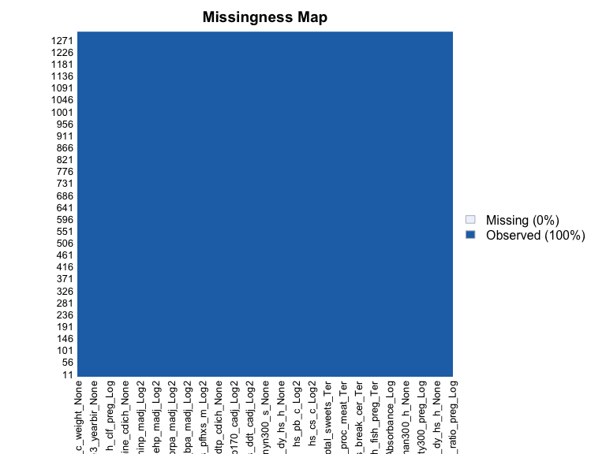
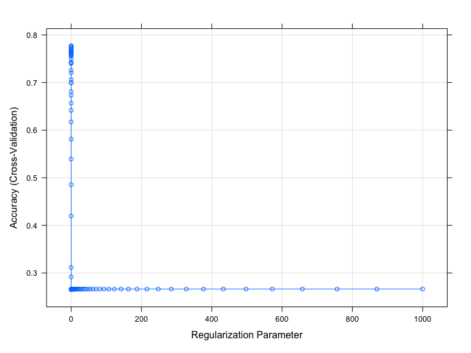
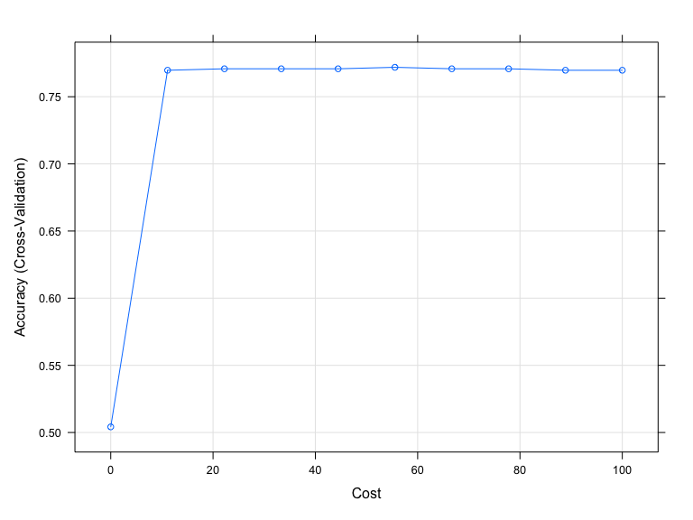

ml_final
================
Mohammad
2023-05-01

## Option 2: The exposome dataset

### Research Question

Can environmental exposures be used to predict asthma diagnosis in
children 6-11 years old?

#### Rationale

Asthma is a major noncommunicable disease that affect both children and
adults but is more exacerbated in children particularly in middle and
low-income countries where it’s often under-diagnosed. Approximately 25
million are diagnosed with Asthma in the US alone. It’s associated with
increased healthcare costs, increased missed school days, and
physician’s visits. Environmental exposures are believed to be a
detrimental factor in asthma development. Intensity and scale of
environmental pollutants and chemical contaminants in both foods and
water are on the rise. However, many are not extensively studied and
their interactions with genetic and socioeconomic factors are not well
understood. Data-driven approaches could provide a flexible and
efficient methods to produce predicts on asthma diagnosis that can have
implication on policy development, resources allocations, and future
research.

### Data preparation

First we load the `exposome` data file then merge `exposome` and
`phenotype` data sets, then remove the `ID` variable. Next, we partition
the data into training and testing data (70/30 split). We convert the
asthma diagnosis outcome variable to factor.

``` r
#Load data using path of where file is stored
load("/Users/mofouda/Desktop/Spring 23/Machine learning/Assignmets/fin_proj/ml_final/data/exposome.RData")

#Merge all data frames into a single data frame
studydata <- 
    merge(exposome, phenotype, by="ID") %>% 
    merge(covariates, by="ID") %>% 
    select(-ID) %>% 
    mutate(hs_asthma = factor(hs_asthma))

#Partition data for use in demonstration
set.seed(123)

train.index <- 
    studydata$hs_asthma %>% 
    createDataPartition(p = 0.7, list = FALSE)

train_df <- 
    studydata[train.index, ]

test_df <- 
    studydata[-train.index, ]
```

### Data Exploration of Training Data

In this step we perform some data exploration by providing some
descriptive measures (for continuous measures: means and ranges, for
categorical/binary: frequency counts), examining correlations between
features, examine missingness.

The `studydata` dataframe has 1301 observations and 241 features. In
this step we examine the data structure, the outcome variable balance,
missing data, and correlations between features.

``` r
str(studydata)
```

    ## 'data.frame':    1301 obs. of  241 variables:
    ##  $ h_abs_ratio_preg_Log        : num  0.8967 0.8925 0.7787 0.0891 0.6048 ...
    ##  $ h_no2_ratio_preg_Log        : num  2.87 2.98 3.06 3.09 3.85 ...
    ##  $ h_pm10_ratio_preg_None      : num  25.9 25.9 26.1 15 35.2 ...
    ##  $ h_pm25_ratio_preg_None      : num  17.4 18.5 18.7 16.4 14.9 ...
    ##  $ hs_no2_dy_hs_h_Log          : num  2.53 1.93 2.88 1.39 3.2 ...
    ##  $ hs_no2_wk_hs_h_Log          : num  2.58 2.65 2.59 2.46 3.5 ...
    ##  $ hs_no2_yr_hs_h_Log          : num  2.61 2.76 2.36 2.4 3.31 ...
    ##  $ hs_pm10_dy_hs_h_None        : num  22.5 14.1 46.9 29.8 29.8 ...
    ##  $ hs_pm10_wk_hs_h_None        : num  20.9 29.1 31.5 25.2 24.9 ...
    ##  $ hs_pm10_yr_hs_h_None        : num  31.4 31.3 27.5 24 24.8 ...
    ##  $ hs_pm25_dy_hs_h_None        : num  16.95 11.16 28.45 4.62 14.92 ...
    ##  $ hs_pm25_wk_hs_h_None        : num  17 15.9 21.3 11 13.9 ...
    ##  $ hs_pm25_yr_hs_h_None        : num  18.4 17.7 16.8 12.7 13.4 ...
    ##  $ hs_pm25abs_dy_hs_h_Log      : num  0.0974 -0.4304 0.9156 -0.2833 0.9156 ...
    ##  $ hs_pm25abs_wk_hs_h_Log      : num  0.0712 0.2143 0.7197 -0.1387 -0.138 ...
    ##  $ hs_pm25abs_yr_hs_h_Log      : num  0.3211 0.2815 0.0987 0.1777 0.2205 ...
    ##  $ h_accesslines300_preg_dic0  : num  0 0 0 1 1 0 0 0 0 0 ...
    ##  $ h_accesspoints300_preg_Log  : num  1.96 2.37 1.27 4.53 3.06 ...
    ##  $ h_builtdens300_preg_Sqrt    : num  405 311 375 565 585 ...
    ##  $ h_connind300_preg_Sqrt      : num  1.89 6.54 6.26 14.49 18.68 ...
    ##  $ h_fdensity300_preg_Log      : num  10.3 10.3 10.3 13.8 12.2 ...
    ##  $ h_frichness300_preg_None    : num  0 0 0 0.2456 0.0877 ...
    ##  $ h_landuseshan300_preg_None  : num  0.364 0.401 0.288 0.633 0.459 ...
    ##  $ h_popdens_preg_Sqrt         : num  85 85 85 66.5 96.2 ...
    ##  $ h_walkability_mean_preg_None: num  0.175 0.2 0.15 0.35 0.275 0.35 0.2 0.225 0.175 0.375 ...
    ##  $ hs_accesslines300_h_dic0    : num  0 0 0 1 1 0 0 0 0 0 ...
    ##  $ hs_accesspoints300_h_Log    : num  1.675 2.774 0.577 4.584 3.621 ...
    ##  $ hs_builtdens300_h_Sqrt      : num  407 383 375 480 210 ...
    ##  $ hs_connind300_h_Log         : num  4.57 3.75 2.88 5.47 4.82 ...
    ##  $ hs_fdensity300_h_Log        : num  10.3 10.3 10.3 14 11 ...
    ##  $ hs_landuseshan300_h_None    : num  0.354 0.321 0.479 0.454 0.51 ...
    ##  $ hs_popdens_h_Sqrt           : num  84.99 10.25 10.25 66.54 4.56 ...
    ##  $ hs_walkability_mean_h_None  : num  0.375 0.2 0.25 0.525 0.3 0.375 0.3 0.325 0.275 0.525 ...
    ##  $ hs_accesslines300_s_dic0    : num  0 0 0 1 0 0 0 0 0 0 ...
    ##  $ hs_accesspoints300_s_Log    : num  0.577 2.186 2.186 3.285 2.186 ...
    ##  $ hs_builtdens300_s_Sqrt      : num  385 383.6 366.4 406.3 61.9 ...
    ##  $ hs_connind300_s_Log         : num  2.37 3.47 3.98 5.65 4.74 ...
    ##  $ hs_fdensity300_s_Log        : num  10.3 10.3 10.3 12.3 11 ...
    ##  $ hs_landuseshan300_s_None    : num  0.28 0.368 0.325 0.521 0.521 ...
    ##  $ hs_popdens_s_Sqrt           : num  84.99 84.99 84.99 25.71 4.56 ...
    ##  $ h_Absorbance_Log            : num  -0.1351 -0.0577 -0.4372 -0.8705 0.564 ...
    ##  $ h_Benzene_Log               : num  0.572 0.88 1.379 1.168 0.133 ...
    ##  $ h_NO2_Log                   : num  4.58 3.37 4.3 2.5 6.92 ...
    ##  $ h_PM_Log                    : num  2.6 2.33 2.33 1.66 3.62 ...
    ##  $ h_TEX_Log                   : num  2.53 2.84 2.88 2.67 3.43 ...
    ##  $ e3_alcpreg_yn_None          : Factor w/ 2 levels "0","1": 1 1 1 1 1 1 1 2 1 1 ...
    ##  $ h_bfdur_Ter                 : Factor w/ 3 levels "(0,10.8]","(10.8,34.9]",..: 1 1 3 2 2 3 1 3 1 1 ...
    ##  $ h_cereal_preg_Ter           : Factor w/ 3 levels "(0,9]","(9,27.3]",..: 1 1 2 3 1 3 2 1 3 1 ...
    ##  $ h_dairy_preg_Ter            : Factor w/ 3 levels "(0,17.1]","(17.1,27.1]",..: 3 3 3 1 1 3 3 2 1 3 ...
    ##  $ h_fastfood_preg_Ter         : Factor w/ 3 levels "(0,0.25]","(0.25,0.83]",..: 2 3 3 3 3 2 3 3 3 3 ...
    ##  $ h_fish_preg_Ter             : Factor w/ 3 levels "(0,1.9]","(1.9,4.1]",..: 3 3 3 1 3 3 1 2 2 2 ...
    ##  $ h_folic_t1_None             : Factor w/ 2 levels "0","1": 1 1 2 1 1 1 1 1 1 2 ...
    ##  $ h_fruit_preg_Ter            : Factor w/ 3 levels "(0,0.6]","(0.6,18.2]",..: 2 2 2 2 2 2 2 3 2 2 ...
    ##  $ h_legume_preg_Ter           : Factor w/ 3 levels "(0,0.5]","(0.5,2]",..: 3 3 3 3 2 3 2 3 2 3 ...
    ##  $ h_meat_preg_Ter             : Factor w/ 3 levels "(0,6.5]","(6.5,10]",..: 2 3 2 3 1 3 1 3 1 1 ...
    ##  $ h_pamod_t3_None             : Factor w/ 4 levels "None","Often",..: 4 1 2 2 4 4 3 2 2 4 ...
    ##  $ h_pavig_t3_None             : Factor w/ 3 levels "High","Low","Medium": 2 2 2 3 3 3 2 2 2 2 ...
    ##  $ h_veg_preg_Ter              : Factor w/ 3 levels "(0,8.8]","(8.8,16.5]",..: 2 2 2 1 2 2 1 1 2 1 ...
    ##  $ hs_bakery_prod_Ter          : Factor w/ 3 levels "(0,2]","(2,6]",..: 2 1 2 3 2 2 3 3 3 3 ...
    ##  $ hs_beverages_Ter            : Factor w/ 3 levels "(0,0.132]","(0.132,1]",..: 3 2 2 1 2 1 3 1 1 3 ...
    ##  $ hs_break_cer_Ter            : Factor w/ 3 levels "(0,1.1]","(1.1,5.5]",..: 1 1 2 3 2 3 2 2 3 3 ...
    ##  $ hs_caff_drink_Ter           : Factor w/ 2 levels "(0,0.132]","(0.132,Inf]": 1 2 2 1 1 1 2 1 1 1 ...
    ##  $ hs_dairy_Ter                : Factor w/ 3 levels "(0,14.6]","(14.6,25.6]",..: 1 1 1 3 1 3 3 3 2 2 ...
    ##  $ hs_fastfood_Ter             : Factor w/ 3 levels "(0,0.132]","(0.132,0.5]",..: 2 2 2 2 2 1 2 3 3 3 ...
    ##  $ hs_KIDMED_None              : num  2 0 1 2 4 5 2 3 3 3 ...
    ##  $ hs_mvpa_prd_alt_None        : num  47.89 31.83 117.58 -2.03 -7.85 ...
    ##  $ hs_org_food_Ter             : Factor w/ 3 levels "(0,0.132]","(0.132,1]",..: 2 3 2 2 1 3 2 1 3 1 ...
    ##  $ hs_pet_cat_r2_None          : Factor w/ 2 levels "0","1": 1 1 1 2 1 1 2 1 1 2 ...
    ##  $ hs_pet_dog_r2_None          : Factor w/ 2 levels "0","1": 1 1 1 1 2 1 1 1 1 1 ...
    ##  $ hs_pet_None                 : Factor w/ 2 levels "No","Yes": 2 1 1 2 2 2 2 1 2 2 ...
    ##  $ hs_proc_meat_Ter            : Factor w/ 3 levels "(0,1.5]","(1.5,4]",..: 2 2 3 1 3 3 2 2 1 1 ...
    ##  $ hs_readymade_Ter            : Factor w/ 3 levels "(0,0.132]","(0.132,0.5]",..: 1 3 3 3 1 1 2 3 1 1 ...
    ##  $ hs_sd_wk_None               : num  389 523 446 180 454 ...
    ##  $ hs_total_bread_Ter          : Factor w/ 3 levels "(0,7]","(7,17.5]",..: 1 3 1 3 2 3 1 2 3 2 ...
    ##  $ hs_total_cereal_Ter         : Factor w/ 3 levels "(0,14.1]","(14.1,23.6]",..: 1 2 2 3 2 3 1 1 3 2 ...
    ##  $ hs_total_fish_Ter           : Factor w/ 3 levels "(0,1.5]","(1.5,3]",..: 1 1 1 2 3 3 1 2 2 2 ...
    ##  $ hs_total_fruits_Ter         : Factor w/ 3 levels "(0,7]","(7,14.1]",..: 3 1 1 3 3 3 1 2 3 3 ...
    ##  $ hs_total_lipids_Ter         : Factor w/ 3 levels "(0,3]","(3,7]",..: 3 3 3 2 3 2 1 3 3 3 ...
    ##  $ hs_total_meat_Ter           : Factor w/ 3 levels "(0,6]","(6,9]",..: 2 1 3 1 2 3 1 1 1 1 ...
    ##  $ hs_total_potatoes_Ter       : Factor w/ 3 levels "(0,3]","(3,4]",..: 3 2 2 1 1 3 1 3 1 3 ...
    ##  $ hs_total_sweets_Ter         : Factor w/ 3 levels "(0,4.1]","(4.1,8.5]",..: 1 3 3 3 1 3 1 2 3 2 ...
    ##  $ hs_total_veg_Ter            : Factor w/ 3 levels "(0,6]","(6,8.5]",..: 3 2 3 3 1 3 1 3 1 2 ...
    ##  $ hs_total_yog_Ter            : Factor w/ 3 levels "(0,6]","(6,8.5]",..: 1 1 1 3 1 3 3 2 1 1 ...
    ##  $ hs_dif_hours_total_None     : num  9.46 9.6 9.97 10.09 10.52 ...
    ##  $ hs_as_c_Log2                : num  -4.283 -6.43 -7.978 0.632 0.651 ...
    ##  $ hs_as_m_Log2                : num  -19.5 -9.58 -14.92 1.84 1.29 ...
    ##  $ hs_cd_c_Log2                : num  -4.14 -4.25 -4.05 -5.26 -3.75 ...
    ##  $ hs_cd_m_Log2                : num  -3.071 -2.599 -2.966 -0.935 -0.935 ...
    ##  $ hs_co_c_Log2                : num  1.02 -2.62 -2.56 -3 -1.61 ...
    ##  $ hs_co_m_Log2                : num  -4.08 -2.41 -2.63 -2.81 -0.55 ...
    ##  $ hs_cs_c_Log2                : num  0.251 0.202 0.39 0.669 0.903 ...
    ##  $ hs_cs_m_Log2                : num  0.151 -0.272 0.536 0.714 0.138 ...
    ##  $ hs_cu_c_Log2                : num  9.71 9.94 9.93 10.19 9.44 ...
    ##  $ hs_cu_m_Log2                : num  10.22 10.51 10.26 10.09 9.89 ...
    ##  $ hs_hg_c_Log2                : num  -2.152 -1.3 -0.911 1.48 2.862 ...
    ##  $ hs_hg_m_Log2                : num  -3.1203 -1.0233 0.0841 2.211 3.2345 ...
    ##  $ hs_mn_c_Log2                : num  3.46 2.88 3 3.22 2.88 ...
    ##  $ hs_mn_m_Log2                : num  3.61 4.16 2.88 3.25 3.49 ...
    ##  $ hs_mo_c_Log2                : num  0.949 1.07 -0.484 -5.866 -0.252 ...
    ##   [list output truncated]

``` r
summary(studydata[, "hs_asthma"])
```

    ##    0    1 
    ## 1159  142

``` r
#Descriptive statistics
summaries <-
    studydata %>% 
    select(h_abs_ratio_preg_Log, hs_no2_dy_hs_h_Log, h_accesspoints300_preg_Log, 
           hs_walkability_mean_h_None, h_Benzene_Log, h_NO2_Log, e3_alcpreg_yn_None, 
           h_dairy_preg_Ter, h_meat_preg_Ter, h_pamod_t3_None, hs_cu_c_Log2, 
           hs_pfoa_m_Log2, e3_asmokcigd_p_None, hs_pet_None, h_trafnear_preg_pow1over3,
           hs_wgtgain_None, hs_oxbe_madj_Log2, hs_cotinine_mcat_None, h_bro_preg_Log, 
           e3_sex_None, h_edumc_None, hs_child_age_None,hs_asthma, hs_zbmi_who, hs_Gen_Tot, 
           e3_bw, hs_asthma) %>% 
    summary()

summaries
```

    ##  h_abs_ratio_preg_Log hs_no2_dy_hs_h_Log h_accesspoints300_preg_Log
    ##  Min.   :-0.47756     Min.   :0.3797     Min.   :1.270             
    ##  1st Qu.: 0.09776     1st Qu.:2.2867     1st Qu.:1.963             
    ##  Median : 0.30203     Median :2.9618     Median :2.879             
    ##  Mean   : 0.39089     Mean   :2.8307     Mean   :2.670             
    ##  3rd Qu.: 0.72516     3rd Qu.:3.4474     3rd Qu.:3.349             
    ##  Max.   : 1.70921     Max.   :5.1849     Max.   :4.528             
    ##  hs_walkability_mean_h_None h_Benzene_Log       h_NO2_Log    
    ##  Min.   :0.100              Min.   :-0.3296   Min.   :1.573  
    ##  1st Qu.:0.275              1st Qu.: 0.3141   1st Qu.:2.979  
    ##  Median :0.300              Median : 0.5600   Median :3.617  
    ##  Mean   :0.326              Mean   : 0.5987   Mean   :3.833  
    ##  3rd Qu.:0.375              3rd Qu.: 0.8437   3rd Qu.:4.576  
    ##  Max.   :0.600              Max.   : 1.9975   Max.   :7.093  
    ##  e3_alcpreg_yn_None    h_dairy_preg_Ter h_meat_preg_Ter   h_pamod_t3_None
    ##  0:896              (0,17.1]   :270     (0,6.5] :427    None      : 42   
    ##  1:405              (17.1,27.1]:380     (6.5,10]:387    Often     :474   
    ##                     (27.1,Inf] :651     (10,Inf]:487    Sometimes :191   
    ##                                                         Very Often:594   
    ##                                                                          
    ##                                                                          
    ##   hs_cu_c_Log2    hs_pfoa_m_Log2    e3_asmokcigd_p_None hs_pet_None
    ##  Min.   : 9.079   Min.   :-5.4760   Min.   : 0.000      No :807    
    ##  1st Qu.: 9.681   1st Qu.: 0.4107   1st Qu.: 0.000      Yes:494    
    ##  Median : 9.828   Median : 1.2007   Median : 0.000                 
    ##  Mean   : 9.828   Mean   : 1.0479   Mean   : 0.494                 
    ##  3rd Qu.: 9.966   3rd Qu.: 1.7450   3rd Qu.: 0.000                 
    ##  Max.   :12.123   Max.   : 4.9836   Max.   :15.238                 
    ##  h_trafnear_preg_pow1over3 hs_wgtgain_None hs_oxbe_madj_Log2 
    ##  Min.   : 0.000            Min.   : 0.0    Min.   :-10.5100  
    ##  1st Qu.: 7.937            1st Qu.: 9.0    1st Qu.:  0.7601  
    ##  Median :12.119            Median :12.0    Median :  2.5546  
    ##  Mean   :14.989            Mean   :13.5    Mean   :  3.0346  
    ##  3rd Qu.:21.397            3rd Qu.:18.0    3rd Qu.:  4.7789  
    ##  Max.   :39.321            Max.   :55.0    Max.   : 13.6480  
    ##  hs_cotinine_mcat_None h_bro_preg_Log    e3_sex_None  h_edumc_None
    ##  Non-smokers:759       Min.   :-2.9759   female:608   1:178       
    ##  SHS smokers:157       1st Qu.:-0.5009   male  :693   2:449       
    ##  Smokers    :385       Median : 1.8701                3:674       
    ##                        Mean   : 1.2640                            
    ##                        3rd Qu.: 2.7488                            
    ##                        Max.   : 4.9016                            
    ##  hs_child_age_None hs_asthma  hs_zbmi_who        hs_Gen_Tot         e3_bw     
    ##  Min.   : 5.437    0:1159    Min.   :-3.5800   Min.   :  0.00   Min.   :1100  
    ##  1st Qu.: 6.500    1: 142    1st Qu.:-0.4000   1st Qu.: 10.00   1st Qu.:3080  
    ##  Median : 8.033              Median : 0.2800   Median : 20.00   Median :3398  
    ##  Mean   : 7.976              Mean   : 0.4032   Mean   : 24.38   Mean   :3389  
    ##  3rd Qu.: 8.920              3rd Qu.: 1.1300   3rd Qu.: 33.44   3rd Qu.:3720  
    ##  Max.   :12.101              Max.   : 4.7200   Max.   :133.00   Max.   :5260

``` r
#Examine Missingness
Amelia::missmap(studydata)
```



``` r
#Examine correlations between features
cor_studydata <-
    studydata %>% 
    select(where(is.numeric)) %>% 
    cor(use = "complete.obs") %>% 
    findCorrelation(cutoff=0.4)
```

Based on feature summaries including the outcome, we will need to center
and scale the training data (variables have different means) and outcome
is imbalanced requiring choosing an appropriate sampling method. In this
case “up” sampling would be more appropriate.

### Models to address research question

Using a random forest algorithm to train the model for feature
selection. We can get the most important variable in predicting the
asthma diagnosis in children aged 6-11 years. We can then use this data
to allocate resources, design interventions and inform policy.
Identified environmental exposures of concern can further investigated.
We will then compare the performance of this algorithm with two others;
LASSO and support vector classifier with the goal of finding the
“optimal model”. Accuracy, and sensitivity will be used to evaluate
model performance since it’s important that the model accurately
predicts positive outcome.

#### Random Forest

This code chunk uses different combinations of the features in the
`studydata` dataset to train the model. Varying number of trees could be
used in a function to train the model to get the best model. However,
computational capacity is a limitation that significantly increases
model run time (sometimes indefinitely on my personal laptop). As a
result, we restrict to the maximum number of trees to 200 only. We use
Accuracy to evaluate the model since this is a classification problem.

``` r
# Try mtry of all, half of all, sqrt of all features 
mtry <- 
    c(ncol(train_df)-1, sqrt(ncol(train_df)-1), 0.5*ncol(train_df)-1)

mtrygrid <- 
    expand.grid(.mtry = round(mtry))

control <- 
    trainControl(method = "cv", number = 10, sampling = "up")

set.seed(123)
    rf <- 
        train(hs_asthma ~., data = train_df, method = "rf", preProc=c("center", "scale"), 
              trControl = control, metric = "Accuracy", tuneGrid = mtrygrid, importance = TRUE, ntree = 100)

#get the best tune 
rf$bestTune
```

    ##   mtry
    ## 1   15

``` r
#Check model performance 
confusionMatrix(rf)
```

    ## Cross-Validated (10 fold) Confusion Matrix 
    ## 
    ## (entries are percentual average cell counts across resamples)
    ##  
    ##           Reference
    ## Prediction    0    1
    ##          0 88.9 11.0
    ##          1  0.1  0.0
    ##                             
    ##  Accuracy (average) : 0.8893

``` r
#Assess variable importance
varImp(rf)
```

    ## rf variable importance
    ## 
    ##   only 20 most important variables shown (out of 296)
    ## 
    ##                      Importance
    ## hs_pm25_yr_hs_h_None     100.00
    ## hs_mn_c_Log2              82.36
    ## hs_dmtp_cadj_Log2         79.35
    ## hs_dmp_cadj_Log2          78.60
    ## hs_ndvi100_s_None         74.36
    ## hs_cd_c_Log2              73.90
    ## hs_pfoa_c_Log2            71.58
    ## hs_cs_m_Log2              70.70
    ## hs_co_m_Log2              70.66
    ## h_Benzene_Log             70.09
    ## hs_mehp_cadj_Log2         69.88
    ## h_pressure_preg_None      68.02
    ## h_bro_preg_Log            65.60
    ## h_no2_ratio_preg_Log      65.56
    ## hs_mecpp_madj_Log2        65.42
    ## hs_pcb153_cadj_Log2       64.24
    ## hs_mnbp_madj_Log2         63.50
    ## hs_cs_c_Log2              62.99
    ## hs_mvpa_prd_alt_None      62.39
    ## hs_hg_m_Log2              62.28

``` r
rf$finalModel
```

    ## 
    ## Call:
    ##  randomForest(x = x, y = y, ntree = 100, mtry = param$mtry, importance = TRUE) 
    ##                Type of random forest: classification
    ##                      Number of trees: 100
    ## No. of variables tried at each split: 15
    ## 
    ##         OOB estimate of  error rate: 0%
    ## Confusion matrix:
    ##     0   1 class.error
    ## 0 812   0           0
    ## 1   0 812           0

``` r
varImpPlot(rf$finalModel)
```


The model performance is relatively high (Accuracy = 0.89). However, the
model is not very sensitive to predicting the positive outcom. The most
important variables are: `hs_pm25_yr_hs_h_None` a postnatal outdoor
pollutant, `hs_mn_c_Log2` Manganese postnatal exposure,
`hs_dmtp_cadj_Log2` DTMP postnatal pesticide exposure, `s_dmp_cadj_Log2`
also a pesticide, `hs_ndvi100_s_None` an outdoor natural space exposure.

#### LASSO

``` r
#Create grid to search lambda
lambda <- 10^seq(-3, 3, length = 100)

set.seed(123)

lasso <-
    train(hs_asthma ~., data = train_df, method = "glmnet", 
          trControl = trainControl("cv", number = 10, sampling = "up"), 
          preProc = c("center", "scale"), tuneGrid = expand.grid(alpha = 1, lambda = lambda))

#Print the values of alpha and lambda that gave best prediction
lasso$bestTune
```

    ##   alpha lambda
    ## 1     1  0.001

``` r
#Model performance
confusionMatrix(lasso)
```

    ## Cross-Validated (10 fold) Confusion Matrix 
    ## 
    ## (entries are percentual average cell counts across resamples)
    ##  
    ##           Reference
    ## Prediction    0    1
    ##          0 75.4  8.7
    ##          1 13.6  2.3
    ##                             
    ##  Accuracy (average) : 0.7774

``` r
#Get variable importance
varImp(lasso)
```

    ## glmnet variable importance
    ## 
    ##   only 20 most important variables shown (out of 296)
    ## 
    ##                             Overall
    ## h_cohort3                    100.00
    ## hs_hum_wk_hs_h_None           75.50
    ## hs_no2_wk_hs_h_Log            70.19
    ## hs_pcb153_madj_Log2           62.90
    ## h_bro_preg_Log                58.04
    ## hs_uvdvf_dy_hs_h_None         55.25
    ## hs_readymade_Ter(0.5,Inf]     51.38
    ## h_edumc_None3                 49.00
    ## hs_pcb170_madj_Log2           48.25
    ## h_no2_ratio_preg_Log          47.72
    ## e3_sex_Nonemale               47.35
    ## hs_prpa_cadj_Log2             46.86
    ## hs_total_fruits_Ter(7,14.1]   46.68
    ## hs_hum_mt_hs_h_None           45.78
    ## h_fish_preg_Ter(1.9,4.1]      45.22
    ## hs_correct_raven              43.08
    ## hs_pfoa_c_Log2                42.60
    ## hs_beverages_Ter(0.132,1]     41.88
    ## hs_cd_m_Log2                  41.13
    ## hs_pfoa_m_Log2                38.75

``` r
# Model coefficients
coef(lasso$finalModel, lasso$bestTune$lambda)
```

    ## 297 x 1 sparse Matrix of class "dgCMatrix"
    ##                                                              s1
    ## (Intercept)                                       -1.9319365660
    ## h_abs_ratio_preg_Log                              -0.8832724890
    ## h_no2_ratio_preg_Log                              -1.1339646223
    ## h_pm10_ratio_preg_None                            -0.5591240243
    ## h_pm25_ratio_preg_None                             0.7880000108
    ## hs_no2_dy_hs_h_Log                                -0.3696235381
    ## hs_no2_wk_hs_h_Log                                 1.6679650290
    ## hs_no2_yr_hs_h_Log                                -0.4198046287
    ## hs_pm10_dy_hs_h_None                              -0.5804510498
    ## hs_pm10_wk_hs_h_None                               0.3268645356
    ## hs_pm10_yr_hs_h_None                              -0.1640477621
    ## hs_pm25_dy_hs_h_None                              -0.0486644626
    ## hs_pm25_wk_hs_h_None                              -0.2301784399
    ## hs_pm25_yr_hs_h_None                               .           
    ## hs_pm25abs_dy_hs_h_Log                             0.7823652108
    ## hs_pm25abs_wk_hs_h_Log                            -0.3828832800
    ## hs_pm25abs_yr_hs_h_Log                            -0.6044991845
    ## h_accesslines300_preg_dic0                        -0.6853271050
    ## h_accesspoints300_preg_Log                         .           
    ## h_builtdens300_preg_Sqrt                          -0.5841498928
    ## h_connind300_preg_Sqrt                            -0.2346273132
    ## h_fdensity300_preg_Log                             0.3295572151
    ## h_frichness300_preg_None                           .           
    ## h_landuseshan300_preg_None                        -0.2003820059
    ## h_popdens_preg_Sqrt                               -0.2279137214
    ## h_walkability_mean_preg_None                       .           
    ## hs_accesslines300_h_dic0                           0.5075339809
    ## hs_accesspoints300_h_Log                          -0.7261228725
    ## hs_builtdens300_h_Sqrt                            -0.0735058742
    ## hs_connind300_h_Log                                0.5306219282
    ## hs_fdensity300_h_Log                               0.4569332354
    ## hs_landuseshan300_h_None                           0.4281020752
    ## hs_popdens_h_Sqrt                                  .           
    ## hs_walkability_mean_h_None                        -0.0989582057
    ## hs_accesslines300_s_dic0                          -0.3328071737
    ## hs_accesspoints300_s_Log                           0.4322878836
    ## hs_builtdens300_s_Sqrt                             .           
    ## hs_connind300_s_Log                                .           
    ## hs_fdensity300_s_Log                               0.3382292352
    ## hs_landuseshan300_s_None                           0.3421382978
    ## hs_popdens_s_Sqrt                                  0.0033501716
    ## h_Absorbance_Log                                   .           
    ## h_Benzene_Log                                      0.4730012421
    ## h_NO2_Log                                         -0.0268767650
    ## h_PM_Log                                           .           
    ## h_TEX_Log                                         -0.5263128220
    ## e3_alcpreg_yn_None1                                0.0058516493
    ## h_bfdur_Ter(10.8,34.9]                             0.1027374715
    ## h_bfdur_Ter(34.9,Inf]                              0.4918227690
    ## h_cereal_preg_Ter(9,27.3]                          0.1276039335
    ## h_cereal_preg_Ter(27.3,Inf]                        .           
    ## h_dairy_preg_Ter(17.1,27.1]                        0.2273275992
    ## h_dairy_preg_Ter(27.1,Inf]                        -0.5304756734
    ## h_fastfood_preg_Ter(0.25,0.83]                     .           
    ## h_fastfood_preg_Ter(0.83,Inf]                     -0.3104492210
    ## h_fish_preg_Ter(1.9,4.1]                           1.0745562968
    ## h_fish_preg_Ter(4.1,Inf]                           0.5580723001
    ## h_folic_t1_None1                                   .           
    ## h_fruit_preg_Ter(0.6,18.2]                        -0.2013901643
    ## h_fruit_preg_Ter(18.2,Inf]                         .           
    ## h_legume_preg_Ter(0.5,2]                          -0.0307496969
    ## h_legume_preg_Ter(2,Inf]                          -0.5739961817
    ## h_meat_preg_Ter(6.5,10]                            .           
    ## h_meat_preg_Ter(10,Inf]                            0.5739428176
    ## h_pamod_t3_NoneOften                               .           
    ## h_pamod_t3_NoneSometimes                           0.3459501638
    ## h_pamod_t3_NoneVery Often                          0.1690777486
    ## h_pavig_t3_NoneLow                                -0.5770135608
    ## h_pavig_t3_NoneMedium                             -0.7112868709
    ## h_veg_preg_Ter(8.8,16.5]                           0.0473970374
    ## h_veg_preg_Ter(16.5,Inf]                          -0.2015104087
    ## hs_bakery_prod_Ter(2,6]                            0.2879997882
    ## hs_bakery_prod_Ter(6,Inf]                          0.7565728774
    ## hs_beverages_Ter(0.132,1]                          0.9952752748
    ## hs_beverages_Ter(1,Inf]                            0.3779880319
    ## hs_break_cer_Ter(1.1,5.5]                          0.0859676781
    ## hs_break_cer_Ter(5.5,Inf]                          0.6401029949
    ## hs_caff_drink_Ter(0.132,Inf]                       0.0150290467
    ## hs_dairy_Ter(14.6,25.6]                           -0.1675687774
    ## hs_dairy_Ter(25.6,Inf]                             .           
    ## hs_fastfood_Ter(0.132,0.5]                        -0.3393355653
    ## hs_fastfood_Ter(0.5,Inf]                          -0.7908706198
    ## hs_KIDMED_None                                    -0.6647826883
    ## hs_mvpa_prd_alt_None                              -0.4623221678
    ## hs_org_food_Ter(0.132,1]                          -0.4930831663
    ## hs_org_food_Ter(1,Inf]                            -0.4681196738
    ## hs_pet_cat_r2_None1                               -0.7272629668
    ## hs_pet_dog_r2_None1                               -0.0172492383
    ## hs_pet_NoneYes                                     .           
    ## hs_proc_meat_Ter(1.5,4]                           -0.0618933259
    ## hs_proc_meat_Ter(4,Inf]                           -0.5616578082
    ## hs_readymade_Ter(0.132,0.5]                       -0.6486250922
    ## hs_readymade_Ter(0.5,Inf]                         -1.2209864993
    ## hs_sd_wk_None                                     -0.0900323818
    ## hs_total_bread_Ter(7,17.5]                         .           
    ## hs_total_bread_Ter(17.5,Inf]                      -0.0046519208
    ## hs_total_cereal_Ter(14.1,23.6]                     .           
    ## hs_total_cereal_Ter(23.6,Inf]                     -0.3405643394
    ## hs_total_fish_Ter(1.5,3]                           .           
    ## hs_total_fish_Ter(3,Inf]                          -0.0706083280
    ## hs_total_fruits_Ter(7,14.1]                       -1.1093593492
    ## hs_total_fruits_Ter(14.1,Inf]                     -0.4564438434
    ## hs_total_lipids_Ter(3,7]                           0.1107619741
    ## hs_total_lipids_Ter(7,Inf]                        -0.2342718836
    ## hs_total_meat_Ter(6,9]                             0.0372574861
    ## hs_total_meat_Ter(9,Inf]                           0.8047210500
    ## hs_total_potatoes_Ter(3,4]                        -0.4430211748
    ## hs_total_potatoes_Ter(4,Inf]                      -0.7792294075
    ## hs_total_sweets_Ter(4.1,8.5]                       0.4428527563
    ## hs_total_sweets_Ter(8.5,Inf]                      -0.4797060409
    ## hs_total_veg_Ter(6,8.5]                            0.4985271352
    ## hs_total_veg_Ter(8.5,Inf]                          0.5073636943
    ## hs_total_yog_Ter(6,8.5]                           -0.4199949977
    ## hs_total_yog_Ter(8.5,Inf]                          0.1999208820
    ## hs_dif_hours_total_None                           -0.6336388285
    ## hs_as_c_Log2                                      -0.6719911586
    ## hs_as_m_Log2                                       .           
    ## hs_cd_c_Log2                                       .           
    ## hs_cd_m_Log2                                      -0.9774456837
    ## hs_co_c_Log2                                      -0.8672833410
    ## hs_co_m_Log2                                      -0.3078803009
    ## hs_cs_c_Log2                                      -0.2560594841
    ## hs_cs_m_Log2                                      -0.2061501310
    ## hs_cu_c_Log2                                      -0.6174170511
    ## hs_cu_m_Log2                                      -0.1140560027
    ## hs_hg_c_Log2                                       .           
    ## hs_hg_m_Log2                                       0.2339097644
    ## hs_mn_c_Log2                                       0.5468584511
    ## hs_mn_m_Log2                                       0.4918443359
    ## hs_mo_c_Log2                                      -0.0011454064
    ## hs_mo_m_Log2                                       0.0722108054
    ## hs_pb_c_Log2                                       0.4901717182
    ## hs_pb_m_Log2                                       .           
    ## hs_tl_cdich_NoneUndetected                         0.1142751213
    ## hs_tl_mdich_NoneUndetected                        -0.0742959150
    ## h_humidity_preg_None                              -0.4648180409
    ## h_pressure_preg_None                               0.1717683427
    ## h_temperature_preg_None                            .           
    ## hs_hum_mt_hs_h_None                               -1.0879814978
    ## hs_tm_mt_hs_h_None                                 .           
    ## hs_uvdvf_mt_hs_h_None                              0.4659681704
    ## hs_hum_dy_hs_h_None                               -0.0003153907
    ## hs_hum_wk_hs_h_None                                1.7943268909
    ## hs_tm_dy_hs_h_None                                 0.1196991761
    ## hs_tm_wk_hs_h_None                                 0.4250937913
    ## hs_uvdvf_dy_hs_h_None                             -1.3129595900
    ## hs_uvdvf_wk_hs_h_None                              .           
    ## hs_blueyn300_s_None1                               .           
    ## h_blueyn300_preg_None1                            -0.3678964967
    ## h_greenyn300_preg_None1                           -0.1414172568
    ## h_ndvi100_preg_None                                0.5530607131
    ## hs_greenyn300_s_None1                             -0.0149791137
    ## hs_blueyn300_h_None1                               0.5379822711
    ## hs_greenyn300_h_None1                             -0.1424404708
    ## hs_ndvi100_h_None                                 -0.9042490991
    ## hs_ndvi100_s_None                                 -0.3378484703
    ## h_lden_cat_preg_None                              -0.3784959789
    ## hs_ln_cat_h_None2                                 -0.5450515673
    ## hs_ln_cat_h_None3                                 -0.2524321359
    ## hs_ln_cat_h_None4                                 -0.0114813251
    ## hs_ln_cat_h_None5                                  .           
    ## hs_lden_cat_s_None2                               -0.8784079726
    ## hs_lden_cat_s_None3                               -0.1796923472
    ## hs_lden_cat_s_None4                               -0.4298359549
    ## hs_lden_cat_s_None5                                0.4035190545
    ## hs_lden_cat_s_None6                                .           
    ## hs_dde_cadj_Log2                                   0.4034876673
    ## hs_dde_madj_Log2                                  -0.2776607540
    ## hs_ddt_cadj_Log2                                  -0.0150330653
    ## hs_ddt_madj_Log2                                  -0.5562803504
    ## hs_hcb_cadj_Log2                                   0.7405096880
    ## hs_hcb_madj_Log2                                   .           
    ## hs_pcb118_cadj_Log2                                .           
    ## hs_pcb118_madj_Log2                                0.7532705311
    ## hs_pcb138_cadj_Log2                               -0.1249743348
    ## hs_pcb138_madj_Log2                                0.0476810016
    ## hs_pcb153_cadj_Log2                                .           
    ## hs_pcb153_madj_Log2                                1.4947850834
    ## hs_pcb170_cadj_Log2                                0.3119114526
    ## hs_pcb170_madj_Log2                               -1.1467378226
    ## hs_pcb180_cadj_Log2                               -0.0092342790
    ## hs_pcb180_madj_Log2                               -0.7413415988
    ## hs_sumPCBs5_cadj_Log2                             -0.3691723895
    ## hs_sumPCBs5_madj_Log2                             -0.1458476177
    ## hs_dep_cadj_Log2                                  -0.5470196646
    ## hs_dep_madj_Log2                                   0.7453520368
    ## hs_detp_cadj_Log2                                 -0.5853187357
    ## hs_detp_madj_Log2                                 -0.5439684003
    ## hs_dmdtp_cdich_NoneUndetected                     -0.3125104069
    ## hs_dmp_cadj_Log2                                   0.0383142319
    ## hs_dmp_madj_Log2                                   0.0259630302
    ## hs_dmtp_cadj_Log2                                  0.7084411974
    ## hs_dmtp_madj_Log2                                  0.1178776232
    ## hs_pbde153_cadj_Log2                              -0.6519822689
    ## hs_pbde153_madj_Log2                               0.2553929455
    ## hs_pbde47_cadj_Log2                                .           
    ## hs_pbde47_madj_Log2                               -0.1353089709
    ## hs_pfhxs_c_Log2                                    0.3731598342
    ## hs_pfhxs_m_Log2                                    0.4028762354
    ## hs_pfna_c_Log2                                     0.6626356483
    ## hs_pfna_m_Log2                                     0.3035001704
    ## hs_pfoa_c_Log2                                    -1.0122825426
    ## hs_pfoa_m_Log2                                     0.9209741808
    ## hs_pfos_c_Log2                                    -0.1655364721
    ## hs_pfos_m_Log2                                    -0.8286233030
    ## hs_pfunda_c_Log2                                   0.2293590921
    ## hs_pfunda_m_Log2                                   .           
    ## hs_bpa_cadj_Log2                                   0.5122291824
    ## hs_bpa_madj_Log2                                   0.2693597176
    ## hs_bupa_cadj_Log2                                  0.2310053534
    ## hs_bupa_madj_Log2                                 -0.2393990015
    ## hs_etpa_cadj_Log2                                  .           
    ## hs_etpa_madj_Log2                                  0.1849452356
    ## hs_mepa_cadj_Log2                                  0.4278948305
    ## hs_mepa_madj_Log2                                 -0.0500718310
    ## hs_oxbe_cadj_Log2                                  0.1035596368
    ## hs_oxbe_madj_Log2                                  .           
    ## hs_prpa_cadj_Log2                                 -1.1135135195
    ## hs_prpa_madj_Log2                                  0.3435360943
    ## hs_trcs_cadj_Log2                                  0.1777075328
    ## hs_trcs_madj_Log2                                  .           
    ## hs_mbzp_cadj_Log2                                  .           
    ## hs_mbzp_madj_Log2                                  0.0568645483
    ## hs_mecpp_cadj_Log2                                -0.2789491491
    ## hs_mecpp_madj_Log2                                 0.3380717520
    ## hs_mehhp_cadj_Log2                                 .           
    ## hs_mehhp_madj_Log2                                -0.2336030061
    ## hs_mehp_cadj_Log2                                  .           
    ## hs_mehp_madj_Log2                                  0.3042923102
    ## hs_meohp_cadj_Log2                                 .           
    ## hs_meohp_madj_Log2                                 .           
    ## hs_mep_cadj_Log2                                   0.8099348908
    ## hs_mep_madj_Log2                                   0.4895919246
    ## hs_mibp_cadj_Log2                                  0.0217755142
    ## hs_mibp_madj_Log2                                  0.3659081166
    ## hs_mnbp_cadj_Log2                                 -0.1598453792
    ## hs_mnbp_madj_Log2                                 -0.3948922219
    ## hs_ohminp_cadj_Log2                               -0.3516447866
    ## hs_ohminp_madj_Log2                                0.4009201992
    ## hs_oxominp_cadj_Log2                              -0.0103527650
    ## hs_oxominp_madj_Log2                              -0.4340231305
    ## hs_sumDEHP_cadj_Log2                              -0.1892314261
    ## hs_sumDEHP_madj_Log2                              -0.3243401128
    ## FAS_cat_NoneMiddle                                -0.4525126544
    ## FAS_cat_NoneHigh                                   .           
    ## hs_contactfam_3cat_num_NoneOnce a week            -0.6895468782
    ## hs_contactfam_3cat_num_NoneLess than once a week  -0.2130092789
    ## hs_hm_pers_None                                    .           
    ## hs_participation_3cat_None1 organisation          -0.2199225270
    ## hs_participation_3cat_None2 or more organisations -0.3931122830
    ## e3_asmokcigd_p_None                                0.6646009027
    ## hs_cotinine_cdich_NoneUndetected                  -0.1216244843
    ## hs_cotinine_mcat_NoneSHS smokers                   0.1258162754
    ## hs_cotinine_mcat_NoneSmokers                       .           
    ## hs_globalexp2_Noneno exposure                      0.1348437086
    ## hs_smk_parents_Noneneither                        -0.4502749575
    ## hs_smk_parents_Noneone                             0.7589120281
    ## h_distinvnear1_preg_Log                            .           
    ## h_trafload_preg_pow1over3                          0.2396896514
    ## h_trafnear_preg_pow1over3                          .           
    ## hs_trafload_h_pow1over3                            0.2685032337
    ## hs_trafnear_h_pow1over3                            .           
    ## h_bro_preg_Log                                     1.3793289056
    ## h_clf_preg_Log                                    -0.4971489552
    ## h_thm_preg_Log                                     0.4221824038
    ## e3_bw                                              .           
    ## hs_zbmi_who                                        0.7696312204
    ## hs_correct_raven                                  -1.0237729274
    ## hs_Gen_Tot                                        -0.0596200458
    ## hs_bmi_c_cat2                                      .           
    ## hs_bmi_c_cat3                                      0.1382647890
    ## hs_bmi_c_cat4                                      .           
    ## h_cohort2                                          .           
    ## h_cohort3                                         -2.3764916705
    ## h_cohort4                                          0.2981029363
    ## h_cohort5                                          .           
    ## h_cohort6                                         -0.0181305481
    ## e3_sex_Nonemale                                    1.1251807816
    ## e3_yearbir_None2004                                0.1990699573
    ## e3_yearbir_None2005                                .           
    ## e3_yearbir_None2006                               -0.2785643045
    ## e3_yearbir_None2007                               -0.3677443582
    ## e3_yearbir_None2008                                .           
    ## e3_yearbir_None2009                                0.1740803577
    ## h_mbmi_None                                       -0.4019366392
    ## hs_wgtgain_None                                    0.1441222074
    ## e3_gac_None                                       -0.4592023858
    ## h_age_None                                        -0.5853229985
    ## h_edumc_None2                                      .           
    ## h_edumc_None3                                      1.1645699809
    ## h_native_None1                                     .           
    ## h_native_None2                                    -0.0220025458
    ## h_parity_None1                                     0.4624816096
    ## h_parity_None2                                     0.3701414047
    ## hs_child_age_None                                  .           
    ## hs_c_height_None                                   0.5758769741
    ## hs_c_weight_None                                  -0.6390781163

``` r
plot(lasso, xvar = "lambda", label = TRUE)
```



This model performs lower (Accuracy = 0.77). However, it’s more
sensitive in predicting the positive outcome. The most important
variables include: `h_cohort` cohort of inclusion, `hs_hum_wk_hs_h_None`
relative humidity postnatal exposure, and `hs_hum_wk_hs_h_log` NO2
postnatal exposure

#### Support Vector Classifier

In this model we tune the hyperparameter C using a grid and only 5
cross-validations instead of 10 to save runtime. The SVC is a
computationally expensive algorithm

``` r
set.seed(123)

control <- 
    trainControl(method = "cv", number = 5, sampling = "up")

set.seed(123)

svc <- 
    train(hs_asthma ~ ., data = train_df, method = "svmLinear", trControl= control, 
          preProcess = c("center", "scale"), tuneGrid = expand.grid(C = seq(0.0001,100, length = 10)))

#print the best tune
svc$bestTune
```

    ##         C
    ## 6 55.5556

``` r
#Check variable importance
varImp(svc)
```

    ## ROC curve variable importance
    ## 
    ##   only 20 most important variables shown (out of 240)
    ## 
    ##                          Importance
    ## h_popdens_preg_Sqrt          100.00
    ## h_ndvi100_preg_None           90.23
    ## h_builtdens300_preg_Sqrt      85.12
    ## hs_hg_m_Log2                  82.68
    ## hs_KIDMED_None                72.10
    ## h_distinvnear1_preg_Log       69.98
    ## hs_sumPCBs5_madj_Log2         69.86
    ## h_no2_ratio_preg_Log          67.88
    ## hs_pcb118_madj_Log2           65.22
    ## hs_no2_yr_hs_h_Log            64.39
    ## hs_smk_parents_None           62.33
    ## hs_landuseshan300_h_None      60.41
    ## hs_mecpp_cadj_Log2            59.67
    ## h_cohort                      57.78
    ## hs_no2_wk_hs_h_Log            57.64
    ## h_pm10_ratio_preg_None        57.30
    ## h_abs_ratio_preg_Log          56.86
    ## hs_popdens_s_Sqrt             56.83
    ## hs_landuseshan300_s_None      56.61
    ## hs_popdens_h_Sqrt             56.32

``` r
plot(svc)
```



``` r
#check final model
svc$finalModel
```

    ## Support Vector Machine object of class "ksvm" 
    ## 
    ## SV type: C-svc  (classification) 
    ##  parameter : cost C = 55.5556 
    ## 
    ## Linear (vanilla) kernel function. 
    ## 
    ## Number of Support Vectors : 577 
    ## 
    ## Objective Function Value : -30.7976 
    ## Training error : 0

``` r
#Model performance
confusionMatrix(svc)
```

    ## Cross-Validated (5 fold) Confusion Matrix 
    ## 
    ## (entries are percentual average cell counts across resamples)
    ##  
    ##           Reference
    ## Prediction    0    1
    ##          0 75.2  9.0
    ##          1 13.8  2.0
    ##                             
    ##  Accuracy (average) : 0.7719

Similar to LASSO, this SVC model has an accuracy = 0.77 and is more
sensitive to predicting the positive outcome compared to random forest.
The most important variables are: `h_popdens_preg_Sqrt` population
density at pregnancy, `h_ndvi100_preg_None` average NDVI values,
`h_builtdens300_preg_Sqrt` building density during pregnancy,
`hs_hg_m_Log2` mercury exposure during pregnancy, `hs_KIDMED_None` a
lifestyle postnatal exposure.

Based on both the accuracy alone, random forest would be a better model.
However, it failed in predicting the outcome of interest. In contrast,
LASSO and SVC algorithms had similar lower accuracy but were more
sensitive to outcome predictions. Given the flexibility of SVC, it would
be more efficient to choose as the “optimal model”. An advantage of SVC
in this project is its ability to detect non-linearities which can be
important in a dataset like the `exposome`.

### Model Evaluation in test

We then use the model to evaluate the performance in the test dataset.

``` r
set.seed(123)

#Make predictions in test set
predictions <- predict(svc, test_df)

#Get evaluation metrics from test set
confusionMatrix(predictions, test_df$hs_asthma, positive = "1")
```

    ## Confusion Matrix and Statistics
    ## 
    ##           Reference
    ## Prediction   0   1
    ##          0 280  32
    ##          1  67  10
    ##                                           
    ##                Accuracy : 0.7455          
    ##                  95% CI : (0.6992, 0.7881)
    ##     No Information Rate : 0.892           
    ##     P-Value [Acc > NIR] : 1.0000000       
    ##                                           
    ##                   Kappa : 0.0329          
    ##                                           
    ##  Mcnemar's Test P-Value : 0.0006329       
    ##                                           
    ##             Sensitivity : 0.23810         
    ##             Specificity : 0.80692         
    ##          Pos Pred Value : 0.12987         
    ##          Neg Pred Value : 0.89744         
    ##              Prevalence : 0.10797         
    ##          Detection Rate : 0.02571         
    ##    Detection Prevalence : 0.19794         
    ##       Balanced Accuracy : 0.52251         
    ##                                           
    ##        'Positive' Class : 1               
    ## 

#### Limitations and Ethical considerations

One analytic limitation of this project is the limited ability to make
generalization and extrapolations outside the dataset used to train the
model. The predictions are as good as the data. Another is the limited
ability to filer the data by exposure family, period, or location, or
covariate type (e.g., child, maternal). My initial research question was
aimed at maternal environmental exposure. However, due to the nature of
the dataset, this process would have been time-consuming and perhaps
unattainable.

One ethical consideration is the risk of introducing biased predictions.
Asthma is a disease that disproportionately impact children from
low-income communities (the number of black children diagnosed with
asthma in the US are approximately twice as much as white children). The
resulting predictions could have a strong impact on policies and
resource allocation.
